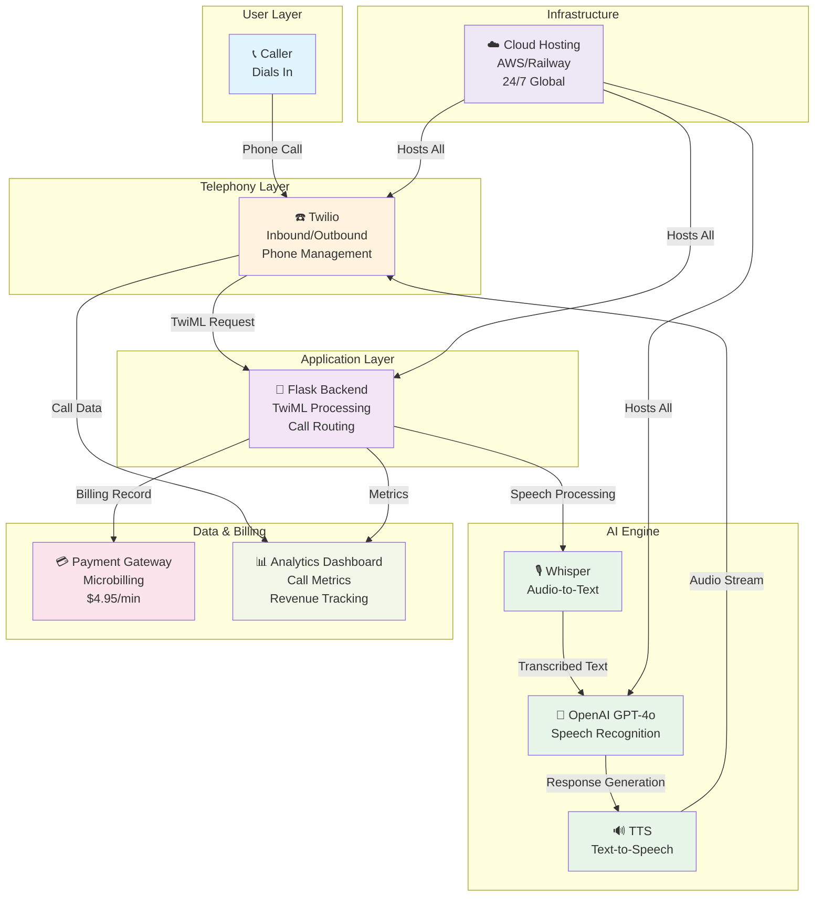
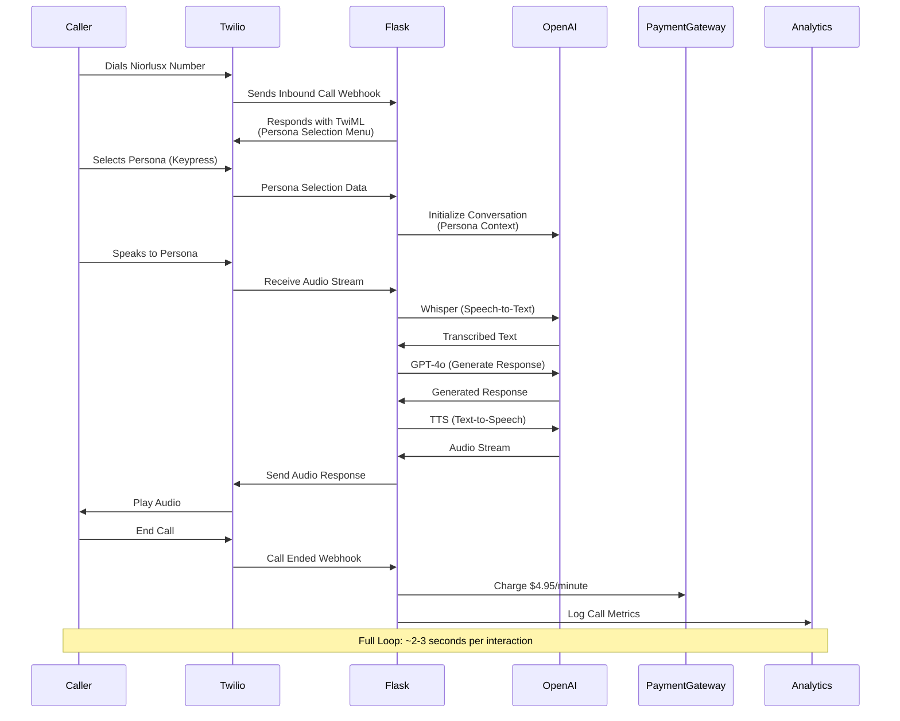
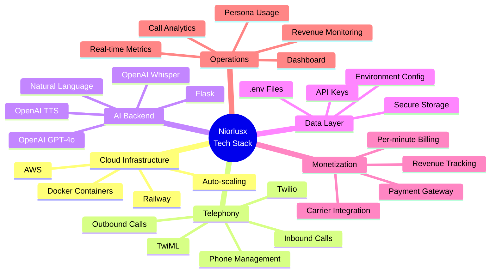
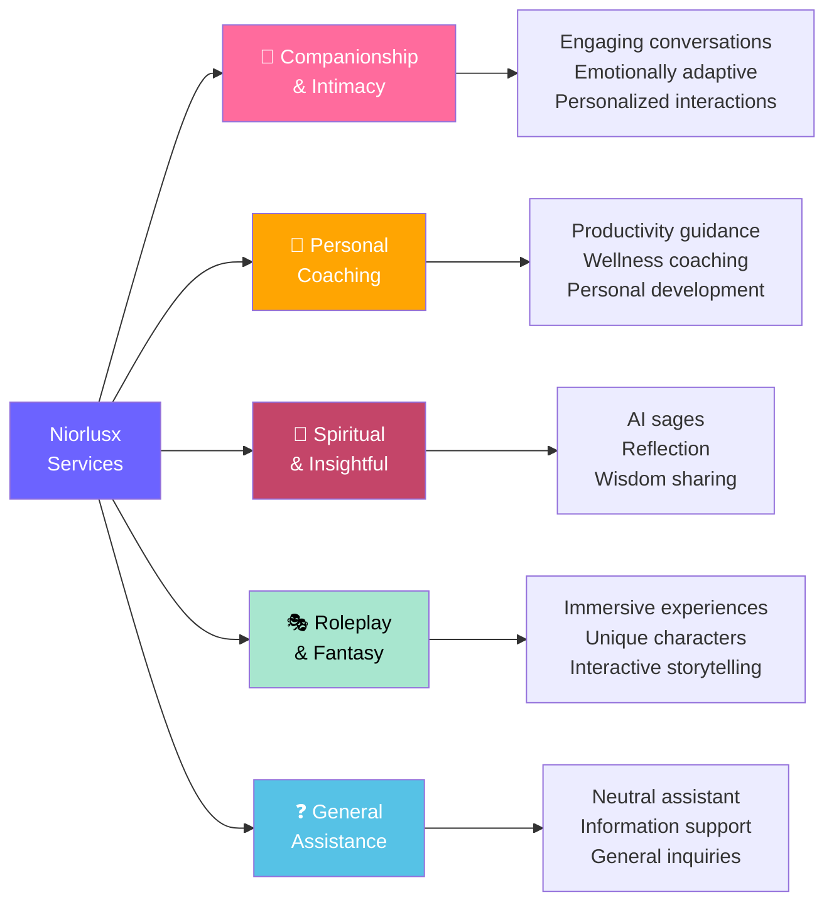
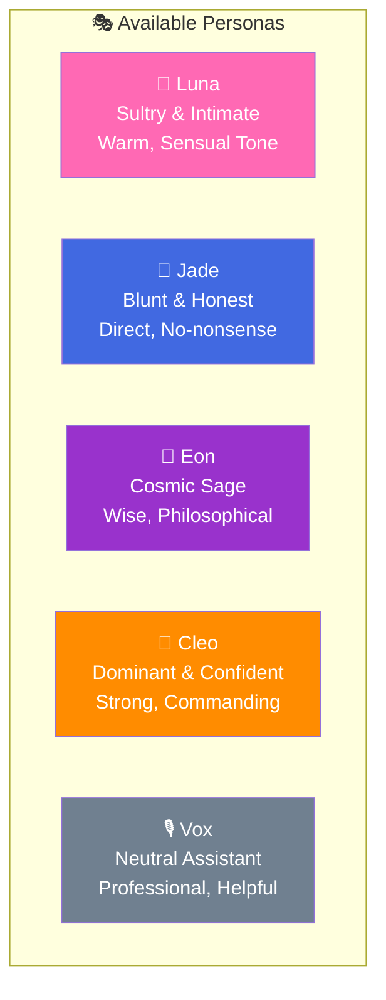
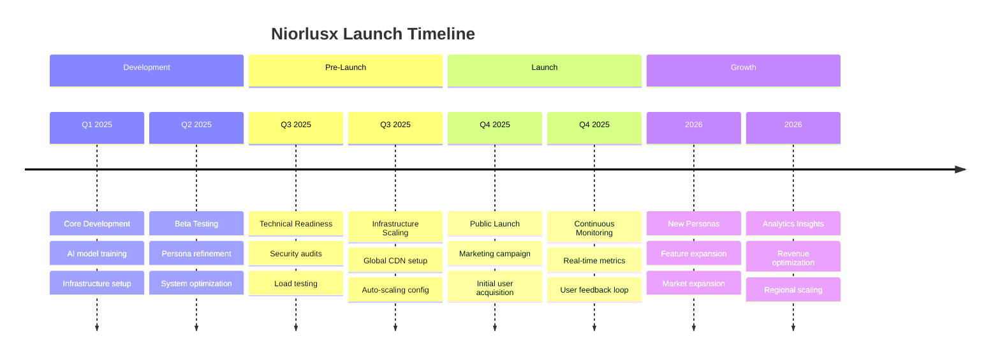

# Niorlusx AI Call Service - Refined Business Blueprint

**Date:** July 13, 2025

## Table of Contents
1. [Quick Overview](#quick-overview)
2. [System Architecture](#system-architecture)
3. [Call Flow Diagram](#call-flow-diagram)
4. [Business Overview](#business-overview)
5. [Key Business Information](#key-business-information)
6. [Provider Setup](#provider-setup)
7. [Services Information](#services-information)
8. [AI Personas](#ai-personas)
9. [Frequently Asked Questions (FAQ)](#faq)
10. [Privacy Policy](#privacy-policy)
11. [Terms of Service](#terms-of-service)
12. [Copyright Information](#copyright-information)
13. [Business Development & Launch](#business-development--launch)

---

## Quick Overview

**Niorlusx** is a revolutionary AI-powered toll-call voice service, offering intelligent and emotionally adaptive AI conversations. This service is designed to be a scalable, high-revenue platform that leverages cutting-edge AI technology with a simple, app-free user experience.

**Developed by:** helpinghands-3631  
**Primary Contact:** Ashley Garner  
**ABN:** 65681861276

---

## System Architecture

---

## Call Flow Diagram

---

## Business Overview

Niorlusx is a revolutionary AI-powered toll-call voice service, offering intelligent and emotionally adaptive AI conversations. This service is designed to be a scalable, high-revenue platform, leveraging state-of-the-art AI technology with a simple, app-free user experience.

**Key Value Propositions:**
- ✅ **No App Required** – Call directly from any phone
- ✅ **Emotionally Adaptive AI** – Personalized interactions based on caller preferences
- ✅ **24/7 Availability** – Always-on service with global reach
- ✅ **Privacy-First** – Anonymous interactions with minimal data retention
- ✅ **Diverse Personas** – Wide range of AI characters for different needs

---

## Key Business Information

| Field | Details |
|-------|---------|
| **Business Name (Development Entity)** | helpinghands-3631 |
| **Primary Contact Name** | Ashley Garner |
| **Australian Business Number (ABN)** | 65681861276 |
| **Business Model** | B2C (Direct-to-Consumer) Toll Service |
| **Revenue Model** | $4.95 per minute |
| **Operating Model** | Fully Automated AI Service |

---

## Provider Setup

Niorlusx operates as a fully automated AI call agency, requiring minimal human intervention for its core operations.

### Technology Stack

### Setup Components

- **Cloud Infrastructure:** Hosted on scalable cloud platforms (AWS, Railway) to ensure 24/7 availability and global reach
- **Telephony Integration:** Utilizes Twilio for robust inbound and outbound call handling, phone number management, and TwiML-based call flow control
- **AI Backend:** Flask application integrating OpenAI (GPT-4o, Whisper, TTS) for natural language understanding, response generation, and voice synthesis
- **Payment Gateway:** Carrier billing for secure, per-minute microbilling and revenue management
- **Environment Configuration:** Secure management of API keys and sensitive credentials via environment variables (`.env` file)
- **Monitoring & Analytics:** Integrated dashboard for real-time service status, active call metrics, persona usage, and revenue tracking

---

## Services Information

Niorlusx provides a diverse range of AI voice services, tailored to caller needs:

---

## AI Personas

| Persona | Personality | Voice Mood | Best For |
|---------|-------------|-----------|----------|
| **Luna** 🌙 | Sultry & Intimate | Warm, Sensual | Companionship, Relaxation |
| **Jade** 💎 | Blunt & Honest | Direct, Edgy | Coaching, Motivation |
| **Eon** 🌌 | Cosmic Sage | Philosophical, Calm | Spiritual Guidance, Reflection |
| **Cleo** 👑 | Dominant & Confident | Strong, Commanding | Roleplay, Empowerment |
| **Vox** 🎙️ | Neutral Assistant | Professional, Helpful | General Assistance, Information |

---

## FAQ

**Q: What is Niorlusx?**  
A: Niorlusx is an AI-powered toll-call voice service where users can dial in to speak with intelligent, emotionally adaptive AI personas for various purposes, from companionship to coaching.

**Q: How much does it cost?**  
A: Calls are monetized at a flat rate of **$4.95 per minute**, charged directly to the caller's phone bill.

**Q: Do I need to download an app?**  
A: No, Niorlusx is accessible directly via a phone call, requiring no app downloads or registration.

**Q: What kind of AI personas are available?**  
A: We offer a range of personas with different personalities and voice moods, including Luna (sultry), Jade (blunt), Eon (cosmic sage), Cleo (dominant), and Vox (neutral assistant).

**Q: Is my privacy protected?**  
A: Yes, Niorlusx is designed with privacy in mind, adhering to strict data protection principles and ensuring anonymous interactions.

**Q: How do I get started?**  
A: Simply dial the Niorlusx phone number, select your preferred persona, and start conversing. No account or registration needed.

**Q: Can I call 24/7?**  
A: Yes, the service is available 24 hours a day, 7 days a week with no downtime or geographic restrictions.

**Q: How long can I stay on a call?**  
A: There is no time limit. You can talk as long as you want; charges continue at $4.95 per minute.

---

## Privacy Policy

### Data Collection
Information collected includes:
- Call duration and frequency
- Persona selection data
- Anonymized interaction patterns
- Call quality metrics
- Timestamp information

### Data Usage
Collected data is utilized for:
- Service improvement and optimization
- Personalization of future interactions
- Billing and revenue management
- Aggregate analytics and trend analysis
- System performance monitoring

### Data Storage & Security
- **Encryption:** All data transmitted over HTTPS/TLS
- **Access Controls:** Strict role-based access to sensitive data
- **Retention:** Call recordings deleted after 30 days unless legally required
- **Backup:** Regular encrypted backups with disaster recovery protocols

### No Personal Identification
- Personal identifying information (beyond phone number for billing) is **not stored** or linked to conversations
- Conversations are treated as anonymous transactions
- No caller names, addresses, or personal details retained
- Call records linked only by phone number for billing purposes

### Compliance
- **GDPR:** Compliant with EU data protection regulations
- **Australian Privacy Principles (APP):** Adheres to Australian privacy standards
- **Call Recording Laws:** Complies with jurisdiction-specific call recording regulations

### User Rights
- Right to request data deletion
- Right to access call records
- Right to opt-out of analytics
- Right to dispute charges

---

## Terms of Service

### Acceptance of Terms
By using Niorlusx, you agree to these terms and conditions. If you do not agree, please do not use the service.

### Service Usage
**Permitted Uses:**
- Personal conversations and interactions
- Entertainment and companionship
- Coaching and guidance
- Roleplay and fantasy scenarios

**Prohibited Uses:**
- Harassment or abuse toward the AI service
- Illegal activities or content
- Attempts to manipulate billing
- Reverse engineering or unauthorized access

### Billing & Payments
- **Charge Rate:** $4.95 per minute, charged per second (minimum 6 seconds)
- **Billing Cycles:** Real-time billing via phone carrier
- **Payment Methods:** Charged directly to phone bill (carrier billing)
- **No Refunds:** Calls are non-refundable once completed
- **Disputed Charges:** Contact your phone carrier for billing disputes

### Disclaimers
- Service provided "as-is" without warranties
- Niorlusx is not a substitute for professional mental health services
- AI responses are generated by machine learning and may not be accurate
- Limited liability for service interruptions or data loss

### Intellectual Property
- All AI models, personas, and content owned by helpinghands-3631
- Users have limited license to use service for personal purposes only
- No rights granted to copy, modify, or distribute service content

### Dispute Resolution
- Disputes will be resolved through binding arbitration
- Jurisdiction: Australian law applies
- Venue: Sydney, Australia

### Changes to Terms
- Niorlusx reserves the right to modify terms at any time
- Users will be notified of material changes
- Continued use constitutes acceptance of new terms

---

## Copyright Information

© 2025 helpinghands-3631. All rights reserved.

All content, technology, AI models, personas, and intellectual property associated with the Niorlusx AI Call Service are the exclusive property of helpinghands-3631, developed by Ashley Garner (ABN: 65681861276).

This includes but is not limited to:
- AI conversation models and training data
- Voice personas and character design
- Twilio integration and custom TwiML scripts
- Flask backend architecture
- User interface and experience design
- All branding, trademarks, and logos

Unauthorized reproduction, distribution, or modification of any part of this service or its underlying technology is strictly prohibited.

---

## Business Development & Launch

### Launch Strategy

The Niorlusx AI Call Service has been developed by helpinghands-3631, focusing on a robust, scalable, and secure architecture.

**Key Launch Activities:**

- **Technical Readiness:** Ensuring all AI, telephony, and billing systems are fully operational and tested under high load
- **Infrastructure Scaling:** Preparing for high concurrent call volumes and global expansion with auto-scaling and redundancy
- **Marketing & Outreach:** Implementing strategies to reach target audiences, emphasizing the unique value proposition of instant, app-less access
- **Continuous Improvement:** Ongoing development of new personas, features, and AI capabilities based on user feedback and market trends
- **Revenue Optimization:** Dynamic pricing strategies, persona recommendations, and upsell opportunities
- **Community Building:** User engagement programs, feedback channels, and loyalty incentives

### Future Roadmap

**Phase 2 (2026-2027):**
- Additional AI personas (20+ characters)
- Multi-language support
- Video call capabilities
- Advanced personalization engine
- Enterprise/B2B tier

**Phase 3 (2027-2028):**
- AI persona customization marketplace
- Third-party integrations
- Advanced analytics platform
- API for developers
- Global expansion to 50+ countries

---

**This blueprint serves as a foundational document for the Niorlusx AI Call Service, guiding its operations, legal compliance, and future growth.**
